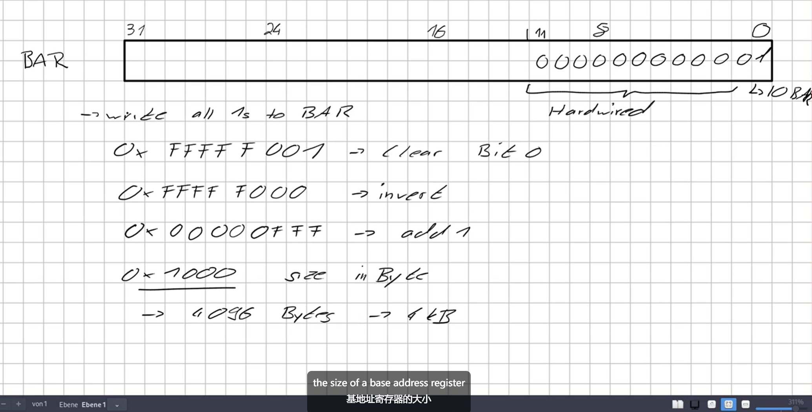
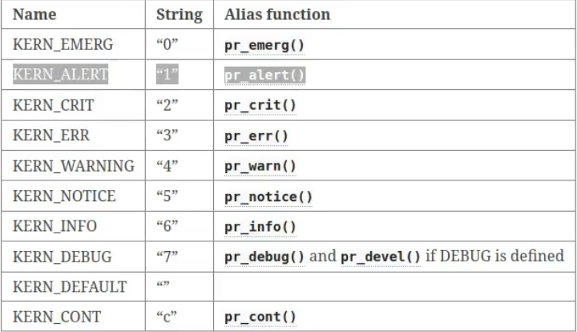

数据手册：
https://www.alldatasheet.com/datasheet-pdf/download/56252/ATMEL/AT24C02N-10SU-2.7.html

256： 表示芯片内部有 256 个可寻址的“存储位置”。这需要一个 8 位的地址（因为 2^8 = 256）来唯一指定每个位置。
8： 表示每个存储位置可以存放 8 个比特的数据，也就是 1 个字节。

写操作
写字节 Byte Write
流程： Start -> 设备地址(写) -> 数据地址(Word Address) -> 数据(Data) -> Stop。
只有一个字节的数据
对于 2K，可以 1 个字节的数据，也就是 8 位。（1K:128×8，2^7 7 位需要一个字节；2K:256×8，2^8>=256 8 位占用一个字节
4K:512×8，2^9>=512 9 位占用两个字节……）

页写 (Page Write)

2. 页写 (Page Write) —— 最大的坑
   为了提高速度，你可以一次发多个字节。
   流程： Start -> 设备地址 -> 数据地址 -> 数据 1 -> 数据 2 ... -> 数据 N -> Stop。

   限制（重点看手册中的 Page Size）：
   AT24C02 的 Page Size 是 8 Bytes。（8-byte Page (1K, 2K), 16-byte Page (4K, 8K, 16K) Write Modes）
   它的内部存储是按“页”划分的（0-7 是第一页，8-15 是第二页...）。
   页回卷 (Roll-over)：如果你从地址 0x00 开始，连续写 10 个字节。
   第 1~8 个字节会正常写入 0x00 ~ 0x07。
   第 9 个字节不会写到 0x08，而是回到本页开头，覆盖掉 0x00 的数据！
   第 10 个字节覆盖 0x01。
   驱动启示：编写驱动的 write 函数时，必须处理边界对齐，不能无脑连续写。
   ”The data word address lower three (1K/2K) or four (4K, 8K, 16K) bits are internally incremented following the receipt of each data word“第三位刚好是 2^3=8 个，每收到一个字节数据，第三位递增，增到八代表第一页写完。

“When the word address,internally generated, reaches the page boundary, the following byte is placed at the beginning of the same page
If more than eight (1K/2K) or sixteen (4K, 8K, 16K) data words are transmitted to the EEPROM, the data word address will “roll over” and previ-ous data will be overwritten.” 3. 写周期 (Write Cycle Time,)
驱动启示：当你发完 Stop 信号后，芯片内部正在搬运电子存储数据，这时候它是“聋”的（不响应 I2C）。你的驱动必须延时 5ms 或者使用 Ack Polling（轮询应答） 技术来等待写入完成。

读操作 (Read Operations) —— 怎么取数据

1. 随机读 (Random Read) —— 最常用
   虽然叫随机读，其实是“指定地址读”。
   流程很有意思，是一个“假写”（告诉你想从那个地址开始读时候，需要先写入这个地址）配合“真读”（然后从这个地址开始读）：
   Dummy Write（虚写）：Start -> 设备地址(写) -> 数据地址 (你告诉它你想读哪里)。
   注意：发完地址后，不要发数据，也不要发 Stop。
   Restart（重复开始）：Start -> 设备地址(读)。
   Read：读取数据。
2. 顺序读 (Sequential Read)
   读完一个字节后，主机回复 ACK，芯片内部地址计数器自动 +1，继续输出下一个字节。没有“页回卷”的限制，可以一直读完整个芯片。

   

设备地址
Bit 7 Bit 6 Bit 5 Bit 4 Bit 3 Bit 2 Bit 1 Bit 0
1 0 1 0 A2 A1 A0 R/W
高 4 位 (Fixed)：AT24C 系列固定是 1010 (十六进制 0xA)。
中间 3 位 (Hardware)：对应硬件引脚 A2, A1, A0 的电平。
通常在开发板上，A0/A1/A2 都接地（GND = 0）。
最低位 (R/W)：读写标志位（写是 0，读是 1）。

Word Address：256 个地址中，你要把“数据”写在哪个存储位置中

Linux/linux_sdk/kernel/arch/arm64/boot/dts/rockchip/rk3568-evb1-ddr4-v10.dtsi 在这个文件中打开设备节点代码如下：

```c
&i2c3 {
    status = "okay";                // 1. 启用控制器
    pinctrl-names = "default";      // 2. 定义引脚状态名
    pinctrl-0 = <&i2c3m0_xfer>;     // 3. 关键！指定使用 M0 组引脚 (对应原理图的 _M0)

    /* 如果设备对时钟频率有要求，可以设置频率，默认通常是 100k 或 400k */
    // clock-frequency = <100000>;

    /* 如果你需要在这个 I2C 下挂载设备，写在这里 */
    /*
    mysensor: mysensor@50 {
        compatible = "my-sensor";
        reg = <0x50>;
    };
    */
};
```

Linux/linux_sdk/kernel/arch/arm64/boot/dts/rockchip/rk3568.dtsi 这个里面有比较详细的 i2c3 描述

```
		pinctrl-names = "default";
		pinctrl-0 = <&i2c3m0_xfer>;              //<--------------------解开注释
```

Linux/linux_sdk/kernel/arch/arm64/boot/dts/rockchip/rk3568-evb1-ddr4-v10.dtsi 注释代码，涉及到 gpio_fun

编译烧写之后，'''sudo i2cdetect -y 3'''
出现： 50 （不是全--）
topeet@topeet:~$ sudo i2cdetect -y 3

'''
sudo cat /sys/kernel/debug/pinctrl/pinctrl-maps | grep i2c3
'''
结果：group i2c3m0-xfer
function i2c3

```c
#include <linux/module.h>
#include <linux/init.h>
#include <linux/of.h>
#include <linux/of_device.h>
#include <linux/i2c.h>
#include <linux/gpio.h>
#include <linux/gpio/consumer.h>
#include <linux/interrupt.h>
#include <linux/delay.h>
#include <linux/i2c.h>
#include <linux/workqueue.h>
#include <linux/input.h>
#include <linux/device.h>
#include <linux/uaccess.h>
#include <linux/ioctl.h>
#include <linux/fs.h>

#define MY_I2C_NAME "my-at24C02"
// /sys/bus/i2c/devices/3-0050$ cat name my-at24C02
#define IIC_AT24C02_READ 100
#define IIC_AT24C02_WRITE 101

static int major = 0;
struct i2c_client *client;
struct class_device *at24c02_class_device;
static struct class \*at24c02_class;
struct delayed_work work;

/\*\*

- at24c02_chrdev_ioctl - AT24C02 设备的 IOCTL 处理函数
- @file: 文件指针
- @cmd: IOCTL 命令
- @arg: 用户空间传递的参数
- 返回值：成功返回 0，失败返回负的错误码
  */
  long at24c02_chrdev_ioctl(struct file *file, unsigned int cmd, unsigned long arg)
  {
  int ret;
  unsigned char addr;
  // struct ft5x06_data *dev_id;
  unsigned char data;
  unsigned char byte_buf[2];
  unsigned int ker_buf[2];
  unsigned int *usr_buf = (unsigned int *)arg; //<--------------------不懂
  ret = copy_from_user(ker_buf, usr_buf, 8); // 把接收到的地址传入 ker_buf[0] 这个地址就是你想读数据的地址，由用户空间提供
  addr = ker_buf[0];
  switch (cmd)
  {
  case IIC_AT24C02_READ:
  {
  struct i2c_msg msg[2] =
  {
  /*写地址，代表我（主机）要操作你的（从机，ft5x06，client->addr）地址为这个（reg_addr）的寄存器，相当于一个请求通知*/
  [0] = {
  .addr = client->addr, // 从机地址
  .flags = 0, // 写
  .len = 1,
  .buf = &addr,
  },
  /*主机：我要读取你（从机）寄存器的数据*/
  [1] = {.addr = client->addr,
  .flags = I2C_M_RD, // 读
  .len = 1,
  .buf = &data},
  };
  if (i2c_transfer(client->adapter, msg, 2) != 2)
  return -EIO;
  ker_buf[1] = data; // 把数据放在 kerbuf 中，[0]是地址，[1]是数据
  ret = copy_to_user(usr_buf, ker_buf, 8); // 安全的拷贝给用户空间
  break;
  }
  case IIC_AT24C02_WRITE:
  {
  byte_buf[0] = addr;
  byte_buf[1] = ker_buf[1];
  struct i2c_msg msg[2] =
  {
  /*写地址，代表我（主机）要操作你的（从机，ft5x06，client->addr）地址为这个（reg_addr）的寄存器，相当于一个请求通知\*/
  [0] = {
  .addr = client->addr, // 从机地址
  .flags = 0, // 写
  .len = 2,
  .buf = byte_buf,
  },

              };

          i2c_transfer(client->adapter, msg, 1);
          mdelay(20);
          break;
      }
      default:
          return -EINVAL;
      }
      return 0;

  }

/_定义结构体_/
static struct file_operations at24c02_fops = {
.owner = THIS_MODULE,
.unlocked_ioctl = at24c02_chrdev_ioctl,

};
// at24C02 设备的初始化函数
int at24C02*probe(struct i2c_client *at*client, const struct i2c_device_id *id)
{
printk("%s %s line %d\n", **FILE**, **FUNCTION**, **LINE**);
client = at_client;
major = register_chrdev(0, "100ask_at24c02", &at24c02_fops); /* /dev/at24c02 */
at24c02*class = class_create(THIS_MODULE, "100ask_at24c02_class");
if (IS_ERR(at24c02_class))
{
printk("%s %s line %d\n", **FILE**, **FUNCTION**, **LINE**);
unregister_chrdev(major, "100ask_at24c02");
return PTR_ERR(at24c02_class);
}
device_create(at24c02_class, NULL, MKDEV(major, 0), NULL, "100ask_at24c02"); /* /dev/100ask*at24c02 */

    return 0;

}
// 设备树匹配表
static const struct of_device_id at24C02_id[] = {
{.compatible = MY_I2C_NAME},
{},
};

// 这一行宏非常重要，告诉内核这个模块支持设备树匹配
MODULE_DEVICE_TABLE(of, at24C02_id); //<------------------加

// 3. 传统 I2C 匹配表 (即使不用，也必须写，否则 probe 可能不触发)
static const struct i2c_device_id at24C02_id_table[] = {
{MY_I2C_NAME, 0},
{},
};
int at24C02_remove(struct i2c_client \*client)
{
device_destroy(at24c02_class, MKDEV(major, 0));
class_destroy(at24c02_class);
unregister_chrdev(major, "100ask_at24c02");
return 0;
}
// at24C02 设备驱动结构体
static struct i2c_driver at24C02_driver = {
.driver = {
.owner = THIS_MODULE,
.name = MY_I2C_NAME,
.of_match_table = at24C02_id,
},
.probe = at24C02_probe,
.remove = at24C02_remove,
.id_table = at24C02_id_table, //<------------------加
};

// 驱动初始化函数
static int \_\_init at24C02_driver_init(void)
{
int ret;

    printk("%s %s line %d\n", __FILE__, __FUNCTION__, __LINE__);

    // 注册 i2c 设备驱动
    ret = i2c_add_driver(&at24C02_driver);
    if (ret < 0)
    {
        printk(KERN_INFO "i2c_add_driver is eror\n");
        return ret;
    }
    return 0;

}

static void **exit at24C02_driver_exit(void)
{
printk("%s %s line %d\n", **FILE**, **FUNCTION**, **LINE\_\_);
i2c_del_driver(&at24C02_driver);
}
module_init(at24C02_driver_init);
module_exit(at24C02_driver_exit);
MODULE_LICENSE("GPL");
```
