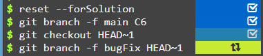
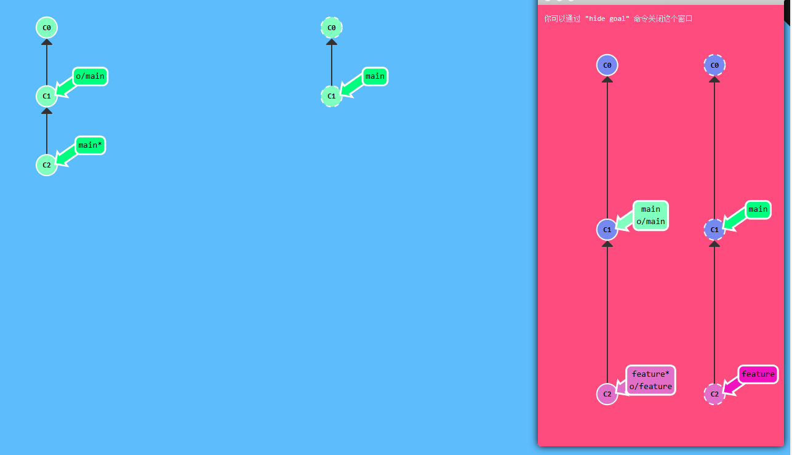
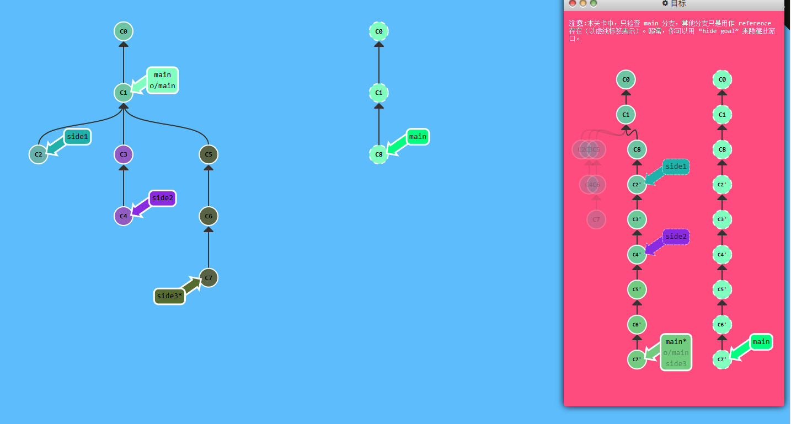

<a href=" https://learngitbranching.js.org/?locale=zh_CN" target="_blank" rel="noopener noreferrer">Learn Git Branching</a>学习总结

### 提交

```PowerShell
git commit
git branch <name> //添加分支
git checkout <name> //切换到分支
git checkout -b bugFix //新建并且切换
```

### 合并分支

- 方法一：使用`git merge`合并两个分支

```
git checkout -b bugFix //新建并且切换
git commit
git checkout main
git commit              //提交main
git merge bugFix   //将bugFix合并进main
```

- 方法二：使用`git rebase`合并两个分支

```
git checkout -b bugFix //新建并且切换
git commit
git checkout main
git commit
git checkout bugFix
git rebase main
```

### Head

我们首先看一下 `HEAD`。 HEAD 是一个对当前所在分支的符号引用 —— 也就是指向你正在其基础上进行工作的提交记录。

`HEAD` 总是指向当前分支上最近一次提交记录。大多数修改提交树的 `Git` 命令都是从改变 `HEAD` 的指向开始的。

HEAD 通常情况下是指向分支名的（如 bugFix）。在你提交时，改变了 bugFix 的状态，这一变化通过 HEAD 变得可见。

如果想看 `HEAD` 指向，可以通过 `cat .git/HEAD `查看， 如果 `HEAD` 指向的是一个引用，还可以用` git symbolic-ref HEAD` 查看它的指向

### 相对引用 `^`

使用`^`向上移动 `1` 个提交记录;使用`~<num> `向上移动多个提交记录，如 `~3`

**让分支指向另一个提交** 例如 :

```
git checkout main^
git branch -f main HEAD~3
git branch -f three C2 //让three指向C2
```



会将 `main` 分支强制指向 `HEAD` 的第 3 级 parent 提交。

### 撤销变更

```
git reset HEAD~1          //当前分支撤销到上一级，仅在本地
git revert C1             //当前分支添加一个新的分支，里面的操作可为撤销，可以远程
git revert C1             //撤销到 C1
```

### 整理提交记录

- `git cherry-pick <提交号>...`

```
git cherry-pick C2 C4` 将 C2 C4（分支上的 指的是哈希值）复制到 main（当前分支）分支
git cherry-pick xx ` 可以将提交树上任何地方的提交记录取过来追加到 HEAD 上
```

- 交互式的 rebase

```
git rebase -i HEAD~4//对 HEAD~4 之后的提交修改顺序
```

### 创建标签

```
git tag v1 C1
git tag v1 main~2(main 的上两级) //建立一个标签，指向提交记录 C1，表示这是我们 1.0 版本
```

`git describe \<ref>`

`<ref>` 可以是任何能被 `Git` 识别成提交记录的引用，如果你没有指定的话，Git 会使用你目前所在的位置（HEAD）。

它输出的结果是这样的：`<tag>_<numCommits>_g<hash>`

- `tag` 表示的是离` ref` 最近的标签， `numCommits `是表示这个`ref`与`tag`相差有多少个提交记录， `hash `表示的是你所给定的 ref 所表示的提交记录哈希值的前几位。

- 当 ref 提交记录上有某个标签时，则只输出标签名称

### 两个 parent 节点

若有两个 parnet 节点，`HEAD^ `代表第一个 parnet 节点，`HEAD^2` 代表另一个不近的节点。

```
git checkout HEAD^2                   //去到当前分支的较远的 parent 节点
git branch bugWork main^^2^           //创建 bugWork 并且移动到 main 父节点的第二个父节点的父节点
```

### 偏离的提交历史

假设你周一克隆了一个仓库，然后开始研发某个新功能。到周五时，你新功能开发测试完毕，可以发布了。但是 —— 天啊！你的同事这周写了一堆代码，还改了许多你的功能中使用的 API，这些变动会导致你新开发的功能变得不可用。但是他们已经将那些提交推送到远程仓库了，因此你的工作就变成了基于项目旧版的代码，与远程仓库最新的代码不匹配了。

```
git fetch;  //更新了本地仓库中的远程分支
git rebase o/main;  //将我们的工作移动到最新的提交记录下
git push  //推送到远程仓库
```

也可以使用 merge

```
git fetch;  //更新了本地仓库中的远程分支
git merge o/main;  //将合并了新变更到我们的本地分支（为了包含远程仓库的变更
git push  //推送到远程仓库
```

`git pull` 就是 `fetch` 和 `merge` 的简写，类似的 `git pull --rebase` 就是 `fetch` 和 `rebase` 的简写

### 远程服务器拒绝!(Remote Rejected)

远程服务器拒绝直接推送(push)提交到 main, 因为策略配置要求 pull requests 来提交更新.

你应该按照流程,新建一个分支, 推送(push)这个分支并申请 pull request,但是你忘记并直接提交给了 main.现在你卡住并且无法推送你的更新

新建一个分支 feature, 推送到远程服务器. 然后 reset 你的 main 分支和远程服务器保持一致, 否则下次你 pull 并且他人的提交和你冲突的时候就会有问题.



```
git branch -f main o/main
git checkout -b feature C2
git push origin feature
```

### 合并多个分支



```
git fetch
git rebase o/main side1
git rebase side1 side2
git rebase side2 side3
git push

```
